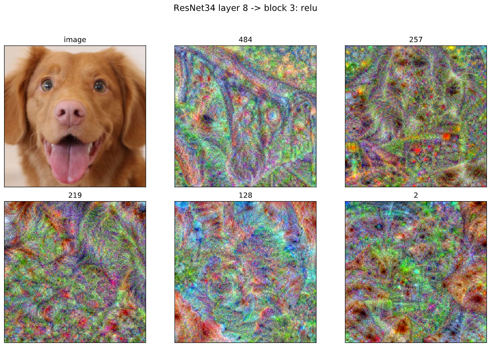

### Visualizing Convolutional Neural Network features based on method purposed by [Erhan et al. (2009)](https://www.researchgate.net/publication/265022827_Visualizing_Higher-Layer_Features_of_a_Deep_Network).

This repository contains the implementation for visualizing the deep layer feature by extending Erhan et al. (2009) for CNN. Visualized feature maps are constructed from randomly initialized noise image by computing the activation maximization. In the first stage, a feature map for different layers has been constructed. Then, we later fit the selected picture to the model to compute the forward propagation. The features seem more complicated at higher layers. Based on the result of n most activated filters, then we constructed the feature maps again for these filters at higher layers using the premonition method, to see how the activation of the feature corresponds to the image.

For the experiment, we used pre-trained torchvision.models.resnet34. However, it can easily be extended to the other models. For more detail, please check out the code and the paper.

#### Files: 
- ```FeatureMapActivator.py```: is used to activate the feature maps (filters) for given layer by doing forward pass.
- ```FilterVisualizer.py```: is used make necessary computation to visualize the features for selected model
- ```utils.py```: utility functions
- ```experiments.ipynb```: contains experiment implemented

#### How to run:
```
conda install nb_conda_kernels
conda env create -f env.yml
ipython kernel install --user --name=explain_cnn_filters
```
